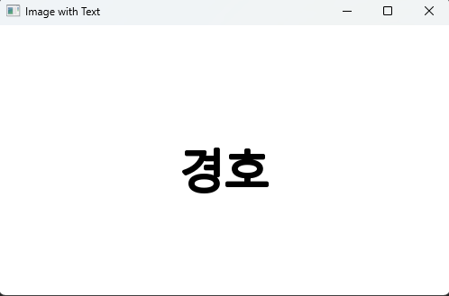
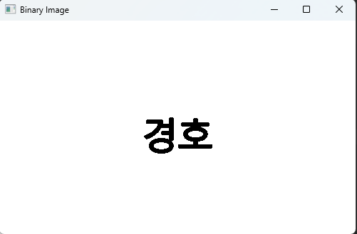
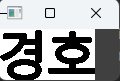
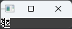
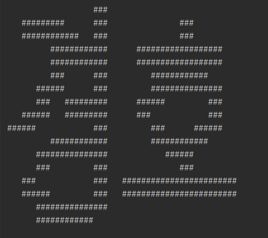
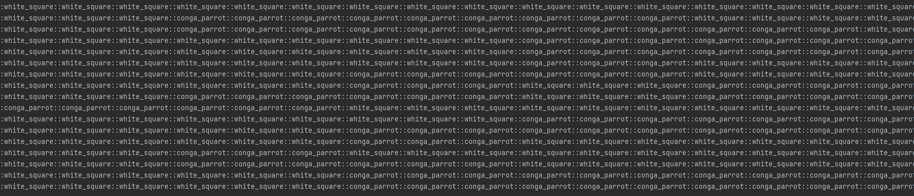

# 글씨 픽셀 아트 프로젝트
글자를 픽셀 아트로 변환하는 프로젝트

# <소개>
- OpenCV를 활용하여 글씨를 이모티콘 픽셀 아트로 변경하는 프로젝트
- 나온 결과물은 slack에서 사용가능
    
  ## 구현
  
    ### 텍스트 이미지 생성
  

    

    - 흰색 배경을 생성뒤 중앙에 텍스트를 생성후 이미지화 

    ### 이진화
  

    

    
    - 이미지를 이진화
 
    ### ROI 지정 및 이미지 크기 조정
  

    

  
    - np.where() 함수를 사용하여 검은 픽셀의 위치를 찾아 이미지의 최솟값과 최대값을 계산하여 관심영역을 지정

    

    - slack 채팅창의 "줄바꿈 경계" 길이에 맞게 ROI의 가로 길이를 비율을 유지한채 조정 

    ### 픽셀을 텍스트로 변환
  

    

    
    - 이진화된 ROI 이미지를 순회하면서 검은색(0)인 경우 지정한 문자열 추가, 픽셀 값이 흰색(255) 공백으로 설정

 

    

    - 각 픽셀의 문자열을 적절히 조합하여 결과 텍스트를 생성
  
    ### 결과

    

    - slack에서의 결과
    

## <개발환경>
- IDE : Pycharm
    
